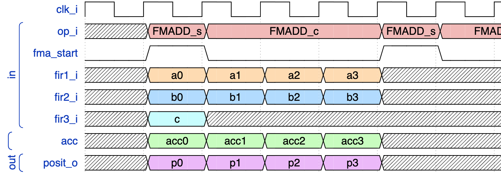

# PPU

    export SIM=questa

    export RISCV_PPU_ROOT=$(cd .. && pwd)

    make -f Makefile_new.mk TOP=tb_ppu





---


## Build instructions

Check out [BUILD.md](./docs/BUILD.md)


(new Dec 2022)


edit the `Makefile_new.mk` `TOP`, `N`, `ES`, `WORD`, `F` fields and then generate the test vector file `sim/test_vectors/tv_posit_ppu.sv` by invoking

    make -f Makefile_new.mk gen-test-vectors

then run the makefile

    make -f Makefile_new.mk

the generated core will sit in the `a.sv` SystemVerilog file.

---


The design is customizable in terms of Posit format (P<any, any>), operations supported (e.g. including/leaving out conversions) and internal implementations details (e.g. using LUT for division or adding newton-raphson steps) via macros and preprocessor `ifdef`s, 
e.g.:

- bare bone PPU (+ run its testbench) with add/sub/mul/div for P<8,0> for 32 bits cpu:
```sh
make ppu WORD=32 N=8 ES=0 F=0
```
- PPU for P<16,1> + conversions to double precision floating point (f64)
```sh
make ppu WORD=64 N=8 ES=0 F=64
```

- PPU for P<16,0> + conversions to double precision floating point (f64) using LUT to precompute reciprocate of mantissa
```sh
make ppu \
  WORD=64 N=16 ES=0 F=64 \
  DIV_WITH_LUT=1 LUT_SIZE_IN=8 LUT_SIZE_OUT=9
```


To open the waveforms invoke gtkwave with the vcd file generated by the simulator
```sh
gtkwave waveforms/tb_ppu_P16E1.vcd
```
or 
```sh
gtkwave waveforms/tb_ppu_P16E1.gtkw
```
or 
```sh
gtkwave -S gtkwave.tcl waveforms/tb_ppu_P16E1.vcd
```

---
## Pipelined-PPU

```sh
make tb_pipelined WORD=32 N=16 ES=1 F=0
gtkwave sim/waveforms/tb_ppu_pipelined_P16E1.gtkw 
```

## Changelog
- added possibility to generate ppu tests (of the pipelined configuration) with high/low similarity between contiguous operands. Run e.g.:

        make tb_pipelined_long WORD=64 F=0 N=16 ES=1
    
    to compile and run the test bench, and

        gtkwave sim/waveforms/tb_ppu_pipelined_P16E1.gtkw 

    to visualize the waveforms.
    Change the `--least-diverse` to `--most-diverse` and `N` [here](https://bitbucket.org/riscv-ppu/ppu/src/1b4718bdcceea456942dc039c06b7711234f3f78/Makefile#lines-208) or the delays between consecutive operations [here](https://bitbucket.org/riscv-ppu/ppu/src/1b4718bdcceea456942dc039c06b7711234f3f78/scripts/tb_gen_pipelined_long.py#lines-72), if needed.

- generate single test bench suitable file

        make tb_pipelined_long_tb_single_file WORD=64 F=0 N=16 ES=1
    
    inside `$PPU_ROOT/sim/waveforms/tb_pipelined_long_tb_single_file.v` to be imported inside Vivado et al.

